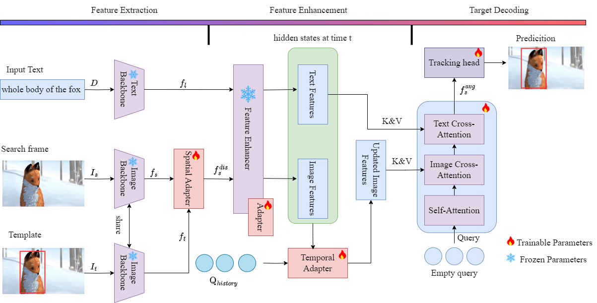

# StreamDNLT
We have carried out a preliminary code release, and optimization will be conducted soon.

StreamDLNT is a generalizable and efficient framework that adapts open-vocabulary detectors via lightweight modular design—encompassing a spatial adapter, a temporal adapter, and a redesigned matching algorithm—to address temporal inconsistency in detection results for natural language tracking. It achieves superior performance on three major benchmarks while significantly reducing training costs.




## Install the environment
Use the Anaconda

```
conda create -n streamdnlt python=3.6
conda activate streamdnlt
bash StreamDNLT/YoloWorld/install.sh
```

## Data Preparation
Put the tracking datasets in ./data. It should look like:
   ```
   ${UVLTrack_ROOT}
    -- data
        -- lasot
            |-- airplane
            |-- basketball
            |-- bear
            ...
        -- otb99
            |-- OTB_query_test
            |-- OTB_query_train
            |-- OTB_videos
        -- refcocog
            |-- refcocog
            |-- split # download this folder from VLTVG (https://github.com/yangli18/VLTVG/blob/master/docs/get_started.md)
            |-- train2014 # coco 2014
            |-- val2014 # coco 2014
        -- tnl2k
            |-- test
            |-- train
   ```


## Train StreamDNLT
Download the pretrained [YoloWorld](https://github.com/AILab-CVC/YOLO-World) and install its environment

Training with Signle GPU.
```
# StreamDNLT
python  StreamDNLT/YoloWorld/lib/train/run_training.py
```

## Evaluation
Download the model weight from [Baidu Netdisk](https://pan.baidu.com/s/1dNInUdi0N9U-h1NaNy8cdQ?pwd=y4sx)

# Testing
python test.py

# Evaluation
python tracking/analysis_results.py --tracker_name uvltrack --tracker_param streamdnlt_yoloworld_tracking --dataset_name <dataset_name>_<reference_modality>_<EPOCH>


## Acknowledgments
* Thanks for [UVLTracker](https://github.com/OpenSpaceAI/UVLTrack), [GroundingDINO](https://github.com/IDEA-Research/GroundingDINO) and [YOLOWorld](https://github.com/AILab-CVC/YOLO-World) Library, which helps us to quickly implement our ideas.
